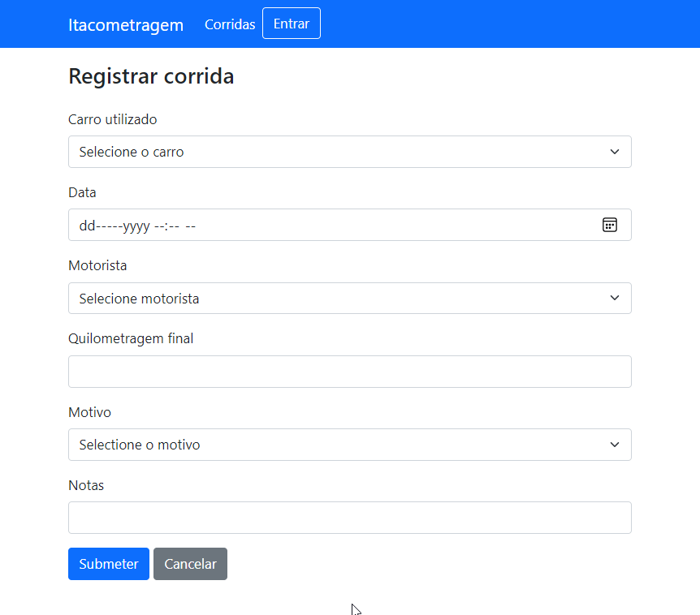
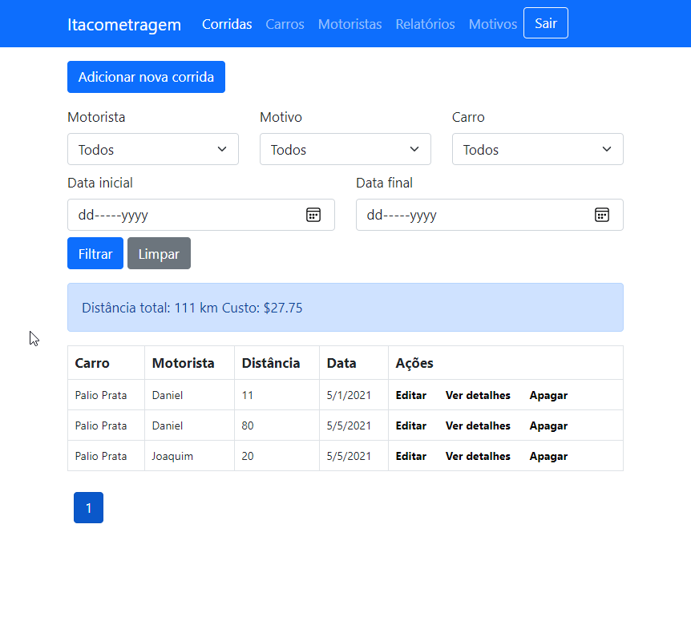
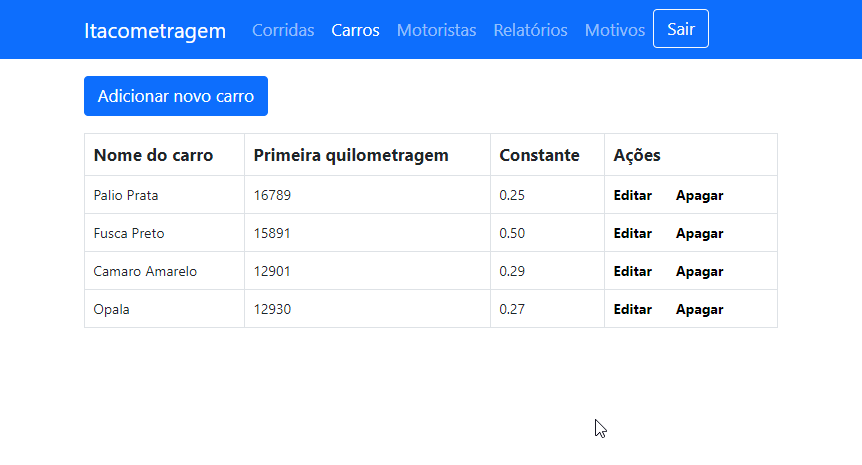
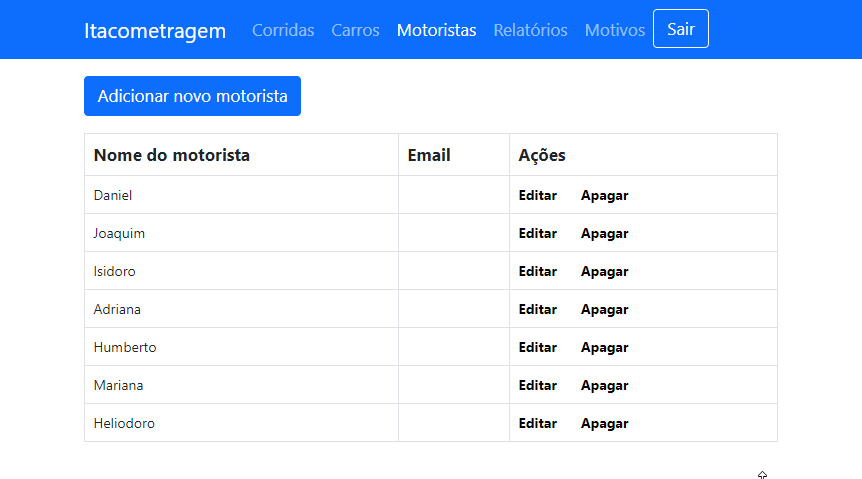
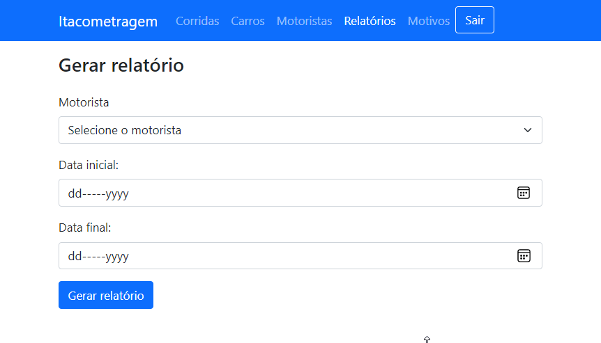
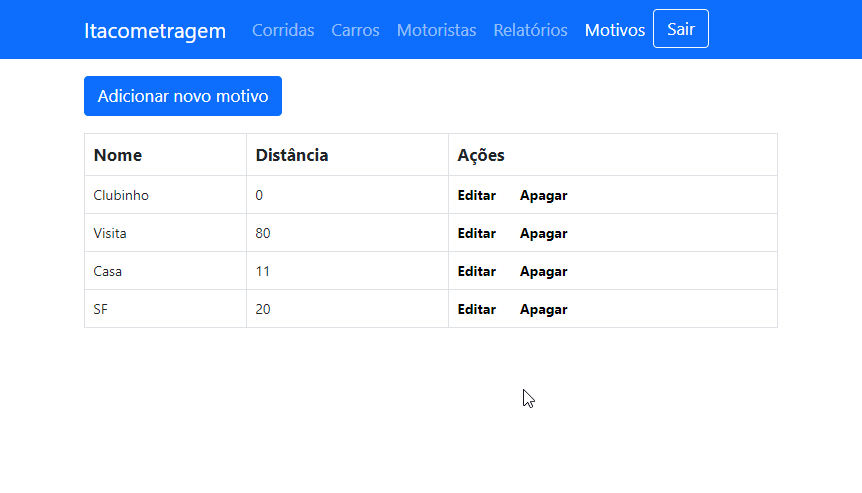

# Itacometragem
Itacometragem é um sistema de controle de quilometragem. Ele fornece uma maneira fácil de acompanhar os quilômetros rodados por cada motorista e em cada carro utilizado por ele.

# Abas
A aplicação abre por padrão na página para adicionar nova corrida, em que o motorista, ao finalizar a corrida, insere seu nome, a data, o valor indicado pelo odômetro e motivo por que fez a corrida. Não é necessário ao motorista fornecer o valor que o odômetro indica ao iniciar a corrida porque a aplicação calcula esse valor a partir das corridas anteriores feitas no veículo em questão.

Para visualizar um registro de todas as corridas realizadas, basta acessar a aba corridas. Nessa página, é possível filtrar os registros a partir do nome do motorista, do motivo, do carro e do período.

# Área de administração
Por padrão, a aplicação registra um único usuário com papel de administração. Ele é responsável por adicionar ao sistema: carros, motivos e motoristas. Além disso, ele também pode gerar relatórios em PDF contendo o registro de todas as corridas **de certo motorista** entre duas datas.

O usuário registrado na área de administrador é _abrete_, e a senha é _sesamo_.

# Desenvolvimento
A aplicação foi desenvolvida no _framework_ ASP.NET MVC na versão 3.1 da plataforma .NET Core, com o banco de dados SQLite. As páginas estão estilizadas com classes de Bootstrap.

# A ser implementado
- Um _script_ JavaScript que busca a última quilometragem registrada assim que o usuário selecione o carro em que está. Esta funcionalidade visa apenas permitir ao motorista verificar eventuais inconsistências nos registros.
- Aumentar a flexibilidade da geração de relatórios. Por enquanto, é possível gerar relatórios de corridas que compartilhem o mesmo motivo. Pretende-se implementar uma interface semelhante àquela da página de corridas, em que possível selecionar vários filtros para ver uma lista de corridas.
